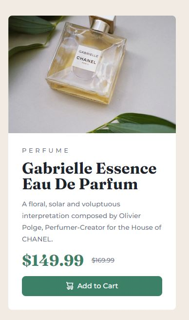

[LiveDemo](https://yeongoh.github.io/product-preview-card-component/)

# Frontend Mentor - Product preview card component solution

This is a solution to the [Product preview card component challenge on Frontend Mentor](https://www.frontendmentor.io/challenges/product-preview-card-component-GO7UmttRfa). Frontend Mentor challenges help you improve your coding skills by building realistic projects.

## Table of contents

- [Overview](#overview)
  - [The challenge](#the-challenge)
  - [Screenshot](#screenshot)
  - [Links](#links)
- [My process](#my-process)
  - [Built with](#built-with)
  - [What I learned](#what-i-learned)
  - [Continued development](#continued-development)
  - [Useful resources](#useful-resources)
- [Author](#author)

## Overview

### The challenge

Users should be able to:

- View the optimal layout depending on their device's screen size
- See hover and focus states for interactive elements

### Screenshot




### Links

- Solution URL: [Add solution URL here](https://your-solution-url.com)
- Live Site URL: [Add live site URL here](https://your-live-site-url.com)

## My process

### Built with

- Semantic HTML5 markup
- Flexbox

### What I learned

- I should set up font-size and color variables in the beginning of the next project. If some text's size was not right, I usually had to change other text sizes as well and it was time consuming.
- I had a hard time tryring to crop the image in mobile. When the container is in column flex direction, it has 100% height just like row flex direction has 100% width. So no matter what I set image's height to, I could not adjust the height. The fix was setting width = 100% and max-height to some rem value. The image will be crushed to match fixed height, then use the object-fit: cover to fix the ratio and use object-position to locate the content of the image.

- I realized later there was a mobile image.

```css
    object-fit: cover;
    object-position: 50% 45%;
    for cropping an image
```

If you want more help with writing markdown, we'd recommend checking out [The Markdown Guide](https://www.markdownguide.org/) to learn more.

**Note: Delete this note and the content within this section and replace with your own learnings.**

### Continued development

setting color and size variables in the beginning for easy adjustments

### Useful resources

https://developer.mozilla.org/en-US/docs/Web/CSS/object-position

## Author

- Frontend Mentor - [@YeongOh](https://www.frontendmentor.io/profile/YeongOh)
